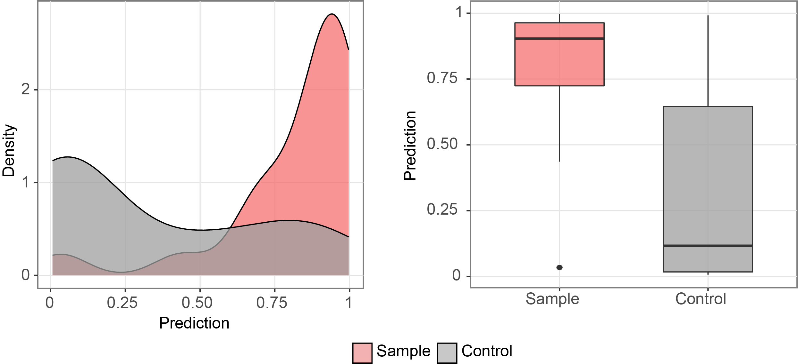

# An example for deeper application

After observing significant differences in the results of Principal Component Analysis (PCA), 
it is possible to train models specifically on the features of interest. Here, I will provide 
an example of training a model using **XGBoost** for the `current_feature.csv` from **nanoCEM**.

## Prepare the data feature

In the current k-mer based RNA modification detection algorithms (such as nanom6A, xPore ...), most of them utilize 5-mer algorithms. 
The following code is used to organize the 5-mer data and perform z-score normalization.

    import numpy as np
    import pandas as pd
    df = pd.read_csv('current_feature.csv')
    k_mer = 5
    kmer_size= int((k_mer-1)/2)
    df = df[(df['position']>=2030-kmer_size)&(df['position']<=2030+kmer_size)]
    grouped_df = df.groupby('Read_ID')
    
    result_list=[]
    for key,temp in grouped_df:
        item = temp[['Mean','STD','Median','Dwell time']].values
        item = item.reshape(-1,).tolist()
        item.append(temp['type'].values[0])
        if len(item)<k_mer*4:
            continue
        result_list.append(item)
    df = pd.DataFrame(result_list)
    result_col = (kmer_size*2+1)*4
    df[result_col+1] = df[result_col].apply(lambda x: 1 if x=='Sample' else 0)
    
    pos_list = [str(num) for num in list(range(0,result_col+2))]
    df.columns=pos_list
    X = df[[str(num) for num in list(range(0,result_col))]]
    y = df[str(result_col+1)]

## Train and test
Perform k-fold cross-validation using XGBoost and calculate the average accuracy.

    from sklearn.metrics import accuracy_score
    from sklearn.model_selection import KFold
    kfold = KFold(n_splits=5)
    # Perform k-fold cross-validation
    accuracy_scores=[]
    for train_index, test_index in kfold.split(X):
        # Split the data into training and testing sets for each fold
        X_train, X_test = X.iloc[train_index], X.iloc[test_index]
        y_train, y_test = y.iloc[train_index], y.iloc[test_index]
    
        # Create an XGBoost classifier
        model = xgboost.XGBClassifier()
    
        # Train the model on the training data
        model.fit(X_train, y_train)
    
        # Make predictions on the testing data
        y_pred = model.predict(X_test)
    
        # Calculate the accuracy score
        accuracy = accuracy_score(y_test, y_pred)
    
        # Store the accuracy score for this fold
        accuracy_scores.append(accuracy)
    
        # Calculate the average accuracy across all folds
    avg_accuracy = sum(accuracy_scores) / len(accuracy_scores)
    print(avg_accuracy)

## Density plot
After obtaining the trained model, it is possible to visualize the distribution of the test data using tools like ggplot.
For example, in the figure below:

    