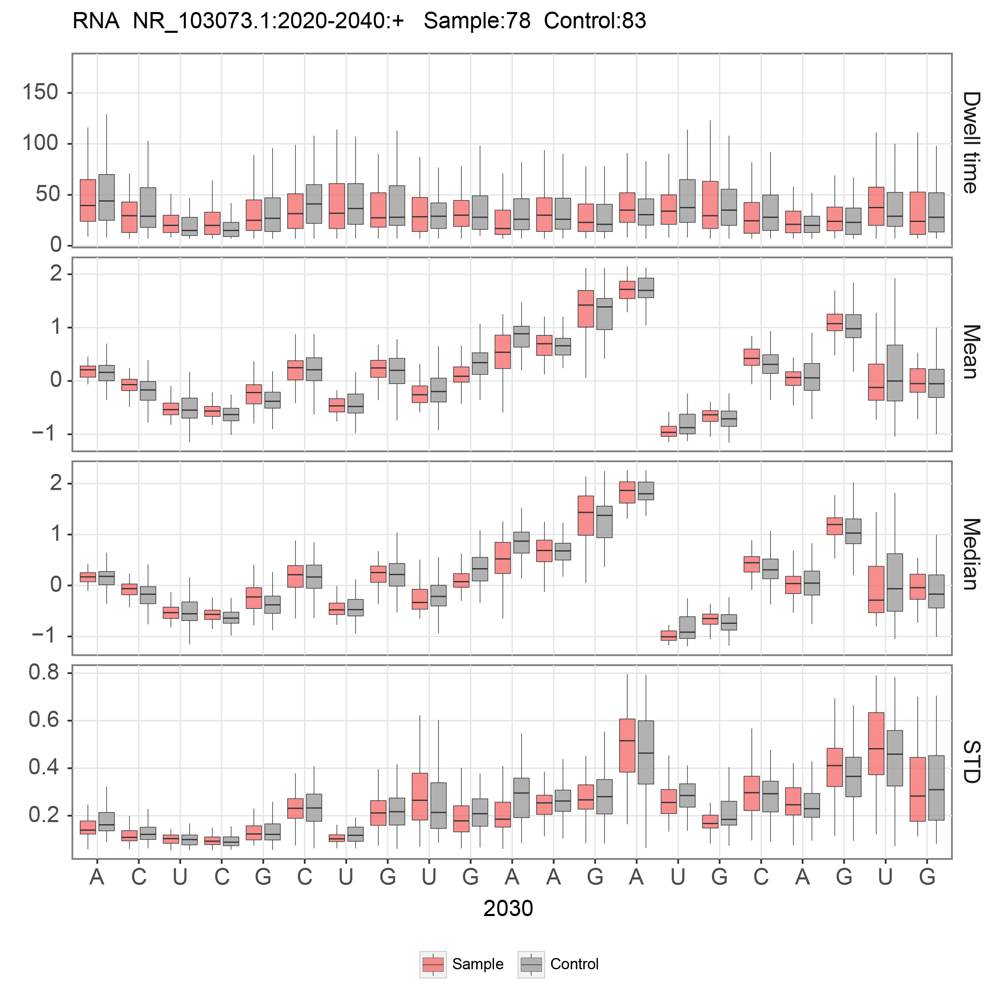

# Welcome to the nanoCEM's documentation !

 
 

nanoCEM (nanopore Current Events Magnifier) 

A Python command-line tool designed to  visualize and analyse multiple statistical features of current events from nanopore sequence data.

## Installation

Before pip installation, make sure you had installed the `samtools`(>=1.16),

    conda install -c bioconda samtools 

To install the latest nanoCEM

    pip install nanoCEM

See our Installation page for details. 

To check the version of nanoCEM, run:

    pip list | grep nanoCEM

 **Notes:** Additionally, we do not rely on any re-squiggle or eventalign packages. We only need their index files for the sequencing data.

## Quick start
This quick start guide outlines the steps to use the nanoCEM command line for analyzing 
Our example data consists of E. coli 23S rRNA. 

Assuming the re-squiggle alignment has been done using either Tombo or f5c,
nanoCEM will generate alignment and current event features in the specified region of interest.

Download the example data

    git clone https://github.com/lrslab/nanoCEM
    cd nanoCEM/example

The path to the downloaded data is as follows:

    data/
        wt/
            file.bam    # alignment file
            file.bam.bai    # index file of alignment file
            file.blow5  # blow5 file for f5c re-squiggle
            file.blow5.idx  # index file of blow5 file
            file.paf    # result file from f5c
            single/ # single-format fast5 files for tombo re-squiggle
        ivt/
            file.bam    # alignment file
            file.bam.bai    # index file of alignment file
            file.blow5  # blow5 file for f5c re-squiggle
            file.blow5.idx  # index file of blow5 file
            file.paf    # result file from f5c
            single/ # fast5 files for tombo re-squiggle
        23S_rRNA.fasta  # reference fasta file
        23S_rRNA.fasta.fai  # index file of fasta file
        ...     

To visualize the alignment feature, 

    # get alignment visualization 
    alignemnt_magnifier -i data/wt/file.bam  -c data/ivt/file.bam  --output nanoCEM_result \
    --chrom NR_103073.1 --pos 2030 --len 10 --strand + \
    --rna --ref data/23S_rRNA.fasta 

Then nanoCEM will output the alignment feature table called [`alignment_feature.csv`](output_format.md) and figure in your interest region as below,

 

For the current event feature, you can choose the re-squiggle result from f5c and tombo. 
They are different in several aspects, including the re-squiggle algorithm 
(which may introduce one base bias) and the supported data types (fast5/blow5).

    # tackle f5c result
    current_events_magnifier f5c -i data/wt/file -c data/ivt/file -o f5c_result \
    --chrom NR_103073.1 --strand + \
    --pos 2030 \
    --ref data/23S_rRNA.fasta \
    --base_shift 2 --rna --norm

Then nanoCEM will output the current feature of your interest region as below,

 

Meanwhile, to visually display the differences in current features 
of selected data points between two groups, 
the selected points(A2030) within each group can be subjected to Principal Component Analysis (PCA).

 

In addition to f5c, nanoCEM also supports tombo, 
and you can achieve the same functionality using the following commands

    # tackle tombo result
    current_events_magnifier tombo -i data/wt/single -c data/ivt/single -o tombo_result \
    --chrom NR_103073.1 --strand + \
    --pos 2030 \
    --ref data/23S_rRNA.fasta \
    --rna --cpu 4 --norm
## Content

* [Tutorials](tutorials.md)
* [Output files description](output_format.md)
* [Data preparation from raw reads](preparation.md)
* [Command line arguments]
* [An example for application]
* [Contacts](contact.md)
