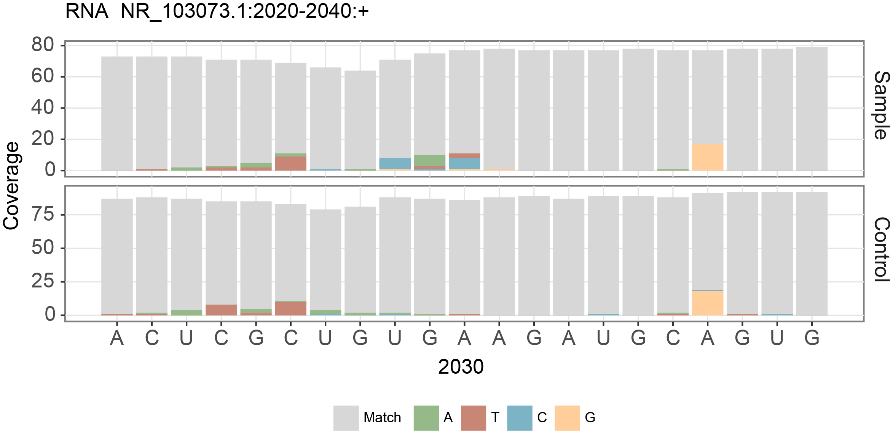

# Quick start

This quick start guide outlines the steps to use the nanoCEM command line for analyzing our example data, which consists
of the E. coli 23S rRNA around a known m6A site (A2030). nanoCEM will calculate alignment features and current event
features within this specified region.

If you want to deal with DNA data, remember to delete all `--rna` in the following commands.

## Dataprep

[comment]: <> (Before utilizing NanoCEM, it is required to convert the raw data format to the appropriate format &#40;single-format `fast5`)

[comment]: <> (or `blow5`&#41; and perform basecalling to obtain a `fastq` file. Subsequently, select a suitable reference `fasta` file)

[comment]: <> (based on research requirements and proceed with the re-squiggle process using either `tombo` or `f5c`.)
Before utilizing nanoCEM, it is required to convert the raw data format to the appropriate format `blow5` and 
perform basecalling to obtain a `fastq` file. Subsequently, select a suitable reference `fasta` file.
The current ONT defaults is to return `pod5` format, here is a script to transfer,
    
    # install package
    pip install blue-crab

    # blow5 to blow5
    blue-crab p2s file.pod5 -o file.blow5

For more details and commands, please refer to the [Data preparation from raw reads](preparation.md) page.

## Download the example data

    git clone https://github.com/lrslab/nanoCEM
    cd nanoCEM/example

The path to the downloaded data is as follows:

    data/
        wt/
            file.blow5  # blow5 file for f5c re-squiggle
            file.fastq # basecall result file
        ivt/
            file.blow5  # blow5 file for f5c re-squiggle
            file.fastq # basecall result file
        23S_rRNA.fasta  # reference fasta file
        ...     

## Alignment feature visualization

To compare two samples' alignment feature,  their `fastq` files , reference file and the specific position are required. Here is a
script using our test data to visualize the alignment feature,

    # get alignment visualization 
    alignment_magnifier -i data/wt/file.fastq  -c data/ivt/file.fastq  \
    --chrom NR_103073.1 --pos 2030 --len 10 --strand + \
    --rna --ref data/23S_rRNA.fasta --output nanoCEM_result 

Then nanoCEM will output the alignment feature table called [`alignment_feature.csv`](output_format.md) and figure in
your interest region as below,

 

## Current event feature visualization

 **Notes:** Our default mode is `f5c`, so our framework internally executes the `f5c` commands. 
 However, for `tombo`, although we have added support for it, you will need to set up the `tombo` environment 
 separately to run the resquiggle command.

### f5c (Default mode)
For the current event feature, we provide  `current_events_magnifier` script. You can choose the re-squiggle program
from `f5c` and `tombo`. They are different in several aspects, including the re-squiggle algorithm
(which may introduce one base bias) and the supported data types (fast5/blow5). 

If you choose `f5c`, make sure that the prefix of `fastq`, `blow5`,`paf` should be the same
for each group as below,

    test/
        file.blow5
        file.fastq

Then you can use `current_events_magnifier` as below,

    # run f5c mode
    current_events_magnifier f5c -i data/wt/file -c data/ivt/file \
    --chrom NR_103073.1 --strand + --pos 2030 \
    --ref data/23S_rRNA.fasta -o nanoCEM_result \
    --base_shift 2 --rna --norm

Then nanoCEM will output the current feature called [`current_feature.csv`](output_format.md) of your interest region
and plot it as below,

 

Meanwhile, to visually display the differences in current features of selected data points between two groups, the
selected points (A2030) within each group can be subjected to Principal Component Analysis (PCA).

 

### tombo support

In addition to `f5c`, nanoCEM also supports `tombo`, and achieves the same functionality by providing the fast5 folder
like the following commands,

    # run tombo mode
    current_events_magnifier tombo -i data/wt/single -c data/ivt/single \
    --chrom NR_103073.1 --strand + --pos 2030 \
    --ref data/23S_rRNA.fasta -o nanoCEM_result \
    --rna --cpu 4 --norm